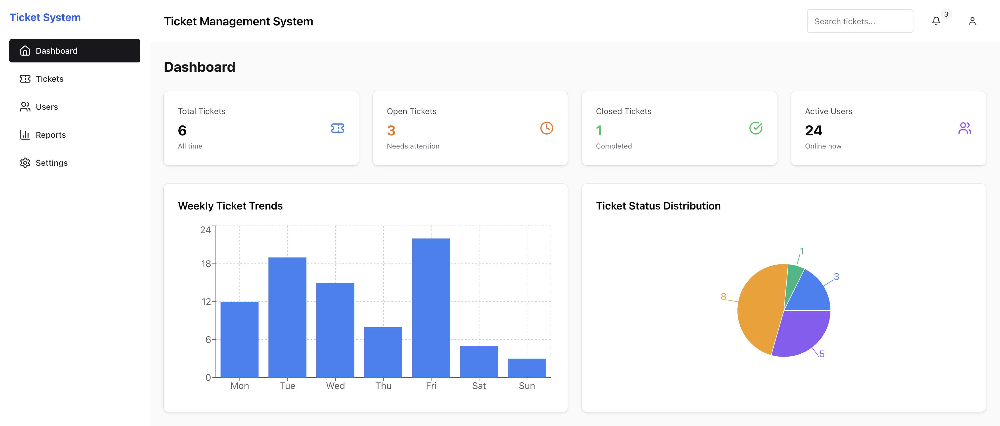

# Ticketing System

A modern full-stack ticketing system built with Spring Boot backend and React TypeScript frontend.



## 🚀 Features

- **Ticket Management**: Create, view, update, and track support tickets
- **User Management**: Manage agents and reporters with role-based access
- **Dashboard Analytics**: Real-time statistics and data visualization
- **Status Tracking**: Track ticket progress from creation to resolution
- **Priority Management**: Assign and manage ticket priorities
- **Agent Assignment**: Automatic and manual ticket assignment to agents
- **SLA Monitoring**: Track service level agreement compliance

## 🛠️ Tech Stack

### Backend
- **Java 17+** - Programming language
- **Spring Boot 3.x** - Application framework
- **Spring Data JPA** - Data persistence
- **H2 Database** - In-memory database for development
- **Maven** - Dependency management and build tool

### Frontend
- **React 18** - UI library
- **TypeScript** - Type-safe JavaScript
- **Vite** - Fast build tool and dev server
- **Chakra UI v3** - Modern component library
- **Tailwind CSS** - Utility-first CSS framework
- **React Router** - Client-side routing
- **Recharts** - Data visualization
- **Axios** - HTTP client

## 📁 Project Structure

```
Project2/
├── server/                 # Spring Boot backend
│   ├── src/main/java/
│   │   └── com/example/springbootapp/
│   │       ├── controller/     # REST controllers
│   │       ├── service/        # Business logic
│   │       ├── entity/         # JPA entities
│   │       ├── repository/     # Data repositories
│   │       └── config/         # Configuration classes
│   ├── src/main/resources/
│   │   ├── application.properties
│   │   └── schema.sql
│   └── pom.xml
│
├── client/                 # React TypeScript frontend
│   ├── src/
│   │   ├── components/         # Reusable UI components
│   │   ├── pages/              # Application pages
│   │   ├── services/           # API service layer
│   │   ├── types/              # TypeScript type definitions
│   │   └── App.tsx
│   ├── package.json
│   └── vite.config.ts
│
└── README.md
```

## 🚦 Getting Started

### Prerequisites

- **Java 17** or higher
- **Node.js 18** or higher
- **Maven 3.6** or higher
- **Bun** (optional, for faster package management)

### Backend Setup

1. Navigate to the server directory:
   ```bash
   cd server
   ```

2. Build the project:
   ```bash
   mvn clean install
   ```

3. Run the Spring Boot application:
   ```bash
   mvn spring-boot:run
   ```
   
   Or run the JAR file:
   ```bash
   java -jar target/spring-boot-app-0.0.1-SNAPSHOT.jar
   ```

The backend will start on `http://localhost:8080`

### Frontend Setup

1. Navigate to the client directory:
   ```bash
   cd client
   ```

2. Install dependencies:
   ```bash
   npm install
   # or
   bun install
   ```

3. Start the development server:
   ```bash
   npm run dev
   # or
   bun run dev
   ```

The frontend will start on `http://localhost:5173`

## 📊 API Endpoints

### Tickets
- `GET /api/v1/tickets` - Get all tickets
- `POST /api/v1/tickets` - Create a new ticket
- `PUT /api/v1/tickets/{id}/status` - Update ticket status
- `GET /api/v1/tickets/dashboard` - Get dashboard analytics

### Users
- `GET /api/v1/users` - Get all users
- `GET /api/v1/users/{id}` - Get user by ID
- `POST /api/v1/users` - Create a new user
- `PUT /api/v1/users/{id}` - Update user
- `DELETE /api/v1/users/{id}` - Delete user

## 🎨 UI Components

### Pages
- **Dashboard** - Analytics and overview
- **Tickets** - Ticket management interface
- **Users** - User management interface

### Components
- **Layout** - Main navigation and layout structure
- **CreateTicketModal** - Ticket creation form

## 🗄️ Database Schema

The application uses the following main entities:

- **Ticket** - Core ticket information
- **User** - System users (agents and reporters)
- **Priority** - Ticket priority levels
- **TicketStatus** - Ticket status tracking
- **TicketType** - Categorization of tickets

## 🔧 Configuration

### Backend Configuration
Configuration is managed through `application.properties`:
- Database connection settings
- Server port configuration
- JPA/Hibernate settings

### Frontend Configuration
- Vite configuration in `vite.config.ts`
- Tailwind CSS configuration in `tailwind.config.js`
- TypeScript configuration in `tsconfig.json`

## 🏗️ Build and Deployment

### Production Build

**Backend:**
```bash
cd server
mvn clean package
```

**Frontend:**
```bash
cd client
npm run build
# or
bun run build
```

### Docker Deployment (Optional)

Create `Dockerfile` for each service and use `docker-compose` for full stack deployment.

## 🧪 Testing

**Backend:**
```bash
cd server
mvn test
```

**Frontend:**
```bash
cd client
npm run test
# or
bun run test
```

## 🤝 Contributing

1. Fork the repository
2. Create a feature branch (`git checkout -b feature/amazing-feature`)
3. Commit your changes (`git commit -m 'Add some amazing feature'`)
4. Push to the branch (`git push origin feature/amazing-feature`)
5. Open a Pull Request

## 📝 License

This project is licensed under the MIT License - see the [LICENSE](LICENSE) file for details.

## 👥 Team

- **Backend Development** - Spring Boot REST API
- **Frontend Development** - React TypeScript UI
- **Database Design** - JPA entity modeling
- **UI/UX Design** - Chakra UI + Tailwind CSS

## 🐛 Known Issues

- Chakra UI v3 compatibility requires specific configuration
- Large bundle size warning in production build (optimization needed)

## 📈 Future Enhancements

- [ ] Email notifications for ticket updates
- [ ] File attachment support
- [ ] Advanced reporting and analytics
- [ ] Mobile-responsive improvements
- [ ] Real-time notifications with WebSocket
- [ ] Docker containerization
- [ ] CI/CD pipeline setup

---

**Built with ❤️ using Spring Boot and React TypeScript**